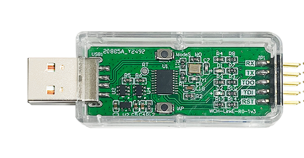

# wchlinke-mode-switch

'wchlinke-mode-switch' is a command-line tool to switch WCH-LinkE modes between DAP and RV. 

WCH-LinkE support online debugging and downloading of WCH RISC-V MCU (2 wires RVSWD / ch32v003 1 wire SDI interface), and also support online debugging and downloading of ARM MCU with SWD/JTAG interface. It also have a serial port.

The dual modes (DAP / RV) of WCH-LinkE can be switched by some official close source utilities, such as MounRiver Studio, WCHISPTool, etc. And also can be switched by onboard 'ModeS' button (and why it have a case ?!).



For more infomation aboud this adapter, please refer to [official website](http://www.wch-ic.com/downloads/WCH-LinkUserManual_PDF.html).

## Install:
```
$ make
$ sudo make install DESTDIR=<as you specify>
```

## Usage:
```
$ wchlinke-mode-switch
```

For switching from DAP mode to RV mode, the output looks like:
```
Found WCH Link or E in DAP Mode.
Switch to RV Mode.
```

For switching from DAP mode to RV mode, the output looks like:
```
Found WCH Link or E in RV Mode.
Switch to DAP Mode.
```

**NOTE:** only WCH-LinkE can be supported, old WCH-LINK is deprecated and can not use this tool to switch mode from host. Mounriver studio will flash a new firmware each time to swith the modes of old WCH-LINK(without E).

